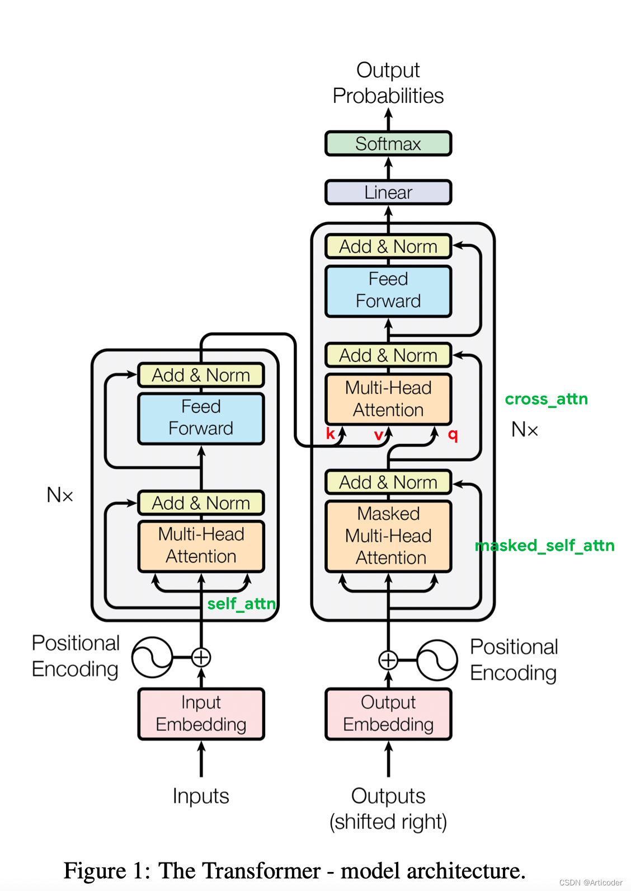

'https://zhuanlan.zhihu.com/p/657456977'(学习路径)
https://blog.csdn.net/qq_41139677/article/details/125252352(学习路径)
（先上图）
## 1. 为什么每个head的维度为d//heads
self.d_k = d_model // heads

## 2. self.q_linear(q).view(bs, -1, self.h, self.d_k)
那假如我的 self.h, self.d_k乘积因为四舍五入不为d_model，那seq_len不就变化了吗

为了避免这种情况，在设计多头注意力机制时，通常会确保 d_model 能够被 heads 整除。这样可以确保每个头的维度 d_k 计算为 d_model // heads，并且在调整张量的形状时不会出现问题。

self.d_k = d_model // heads
assert d_model % heads == 0, "d_model must be divisible by the number of heads"

## 3. 那可以用reshape替换view吗？有什么问题
view性能上更优一些，而且需要变量连续

## 4.为什么需要contiguous()
transpose、permute 操作虽然没有修改底层一维数组，但是新建了一份Tensor元信息，并在新的元信息中的 重新指定 stride。torch.view 方法约定了不修改数组本身，只是使用新的形状查看数据。如果我们在 transpose、permute 操作后执行 view，Pytorch 会抛出以下错误：

invalid argument 2: view size is not compatible with input tensor's size and stride (at least one dimension 
spans across two contiguous subspaces). Call .contiguous() before .view(). 
at /Users/soumith/b101_2/2019_02_08/wheel_build_dirs/wheel_3.6/pytorch/aten/src/TH/generic

## 5. 为什么mask = mask.unsqueeze(1)
在多头注意力机制中，mask 的作用是屏蔽掉不需要关注的位置。
在自然语言处理任务中，mask 通常用于防止模型在生成序列时关注未来的词或者屏蔽掉填充符（padding token）。
在这段代码里，mask 的维度可能是 (batch_size, seq_len)，即每个位置是否被遮盖。
由于注意力机制是多头的，原始的 mask 需要扩展到多个注意力头上。
mask.unsqueeze(1) 通过在维度1插入一个新的维度，将 mask 从 (batch_size, seq_len) 变为 (batch_size, 1, seq_len)。
这样做的目的是让它在每个头部共享，从而与 (batch_size, heads, q_seq_len, k_seq_len) 的注意力得分 scores 匹配，
确保每个注意力头都能应用相同的遮掩。

## 6. 多头注意力中为什么drop在softmax之后
softmax 之前的分数不是概率分布
dropout 需要在概率分布上进行
softmax 的数值敏感性
为了保持注意力机制的稳定性和有效性，dropout 需要在 softmax 之后应用。
这样做可以随机丢弃一部分归一化后的注意力权重，防止模型对某些特定位置的过度依赖，同时又不会破坏 softmax 之前的分数计算。

## 7. attention里面的scores对称吗
不是对称矩阵

在自注意力中可能对称（q==key），但是由于q和k都是经过了linear层，所以他们不是相等的，故不对称

## 8. nn.Module()
https://blog.csdn.net/qq_27825451/article/details/90550890
我们在定义自已的网络的时候，需要继承nn.Module类，并重新实现构造函数__init__构造函数和forward这两个方法。但有一些注意技巧：

（1）一般把网络中具有可学习参数的层（如全连接层、卷积层等）放在构造函数__init__()中，当然我也可以吧不具有参数的层也放在里面；

（2）一般把不具有可学习参数的层(如ReLU、dropout、BatchNormanation层)可放在构造函数中，也可不放在构造函数中，如果不放在构造函数__init__里面，则在forward方法里面可以使用nn.functional来代替
    
（3）forward方法是必须要重写的，它是实现模型的功能，实现各个层之间的连接关系的核心。
